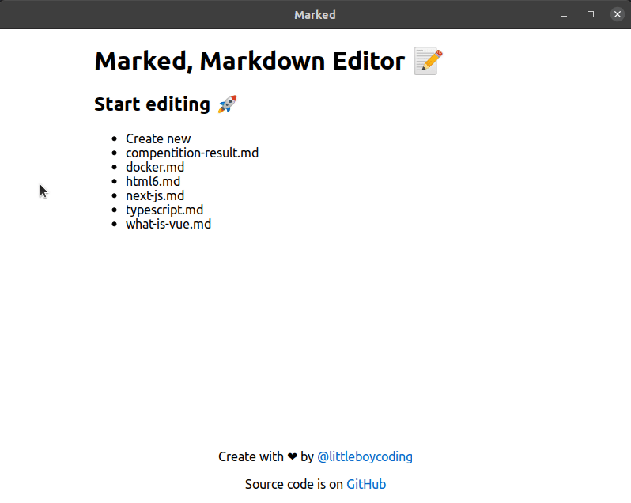

# Marked
Simple and Minimalism markdown editor 🚀

Written in [GO](https://golang.org/) and powered by [Svelte](https://svelte.dev/)

## Feature 🔥
- Single Small binary ! (thanks golang) 🧰
- Support all standard syntax 📚
- Cross-Platform (Linux, WIndows, MacOS) 💻

## Shortcut Key ⌨
| Key | Action |
|---|---|
| Ctrl + Enter | Toggle preview and editing mode |
| Ctrl + S | Write to file |
| Ctrl + Escape | Exit editing mode or leave file |

## TODO 📝
- Support Github flavour and more
- More attractive UI/UX ?
- Add documentaion

This project was created for learning purpose, Source code is free to use for any purposes